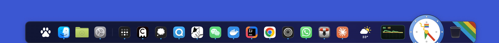

# Jetty

A more feature-rich Dock for macOS.

**Latest release:** v<!-- version -->1.5.0<!-- /version --> · [Download](https://github.com/L-K-M/Jetty/releases/latest)



> [!IMPORTANT]
> LLM Disclosure: Jetty was built with substantial help from large language models.

If you like this, also look at alongside **[Zap](https://github.com/L-K-M/Zap)**
(a ⌘-Tab switcher) and **[Top Drawer](https://github.com/L-K-M/TopDrawer)** (edge-tab
launcher).

## Features

- **Position it anywhere.** Any **edge** (bottom / top / left / right) × any
  **alignment** (leading / center / trailing) × a fine offset and an edge inset, **per
  display**.
- **Live info tiles** — date/time, weather, and more.
- **Make it yours** — rename a pinned item or give it a custom icon, optional retro
  flourishes (corner decorations + CRT scanlines), and **customizable global
  shortcuts** (General ▸ Shortcuts).
- **The Jetty Menu** — a launcher and **command bar**: instant
  app search (type to filter, ↑/↓, ⏎) and recents, an inline **calculator**,
  **unit & currency conversion** (`10 km in miles`, `100 usd to eur`), and **power commands** (Sleep,
  Lock Screen, Log Out, Restart, Shut Down, Empty Trash).
- **Trash tile** — click to open, drop files to delete.
- **Multi-monitor** aware.

### Getting the real Dock back

The clean way is **Settings → General → Restore System Dock** (or the menu-bar item's
**Restore System Dock**), which Jetty also does automatically when you quit it normally.
If Jetty was force-quit, crashed, or was deleted *while* it had the Dock hidden, the
system Dock can stay hidden because its reveal delay is still set very high. Restore it
by hand with one line in Terminal:

```bash
defaults delete com.apple.dock autohide-delay; defaults delete com.apple.dock autohide-time-modifier; killall Dock
```

(Re-launching Jetty and using **Restore System Dock** does the same thing.)

## Build & Run

Requires **Xcode 26** (for Liquid Glass) and **macOS 13+** (Liquid Glass renders on
macOS 26; older systems get a blurred fallback).

```bash
# Build
xcodebuild -project Jetty.xcodeproj -scheme Jetty -configuration Debug build

# Release build
xcodebuild -project Jetty.xcodeproj -scheme Jetty -configuration Release build

# Run unit tests
xcodebuild -project Jetty.xcodeproj -scheme Jetty -destination 'platform=macOS' test
```

`scripts/build.sh` does a convenient incremental Release build via the shared
`lkm-build` engine (`scripts/build.sh --clean` for a clean rebuild).

## Usage

1. Launch Jetty — it appears as a dock glyph in the menu bar and hides the system
   Dock (on by default; turn it off any time in **Settings → General → Hide the
   macOS Dock**, or with **Restore System Dock**).
2. Push the pointer to the bottom of the screen to reveal the dock, or open
   **Jetty Settings…** from the menu-bar item to choose an edge, alignment, and look.
3. Open the **Jetty Menu** from its dock tile, the menu-bar item, or ⌃⌥⌘Space (the
   shortcuts are customizable in General ▸ Shortcuts) to search apps, convert units and
   currencies, do quick math, and run power commands.

## Permissions

The **core dock needs none.** The Jetty Menu's power commands and the Dark Mode quick
toggle ask for **Automation** the first time (to tell System Events to sleep / restart /
toggle appearance). The optional **now-playing** tile (which you add yourself; it is not
in the default dock) reads the system's current track via Apple's private MediaRemote
framework — it stays local, is never transmitted, and fails closed (shows a plain music
glyph) if the framework is unavailable. **Hover window previews** (opt-in) show an app's
windows when you hover its tile: the default **Window names** mode needs nothing;
**Live thumbnails** ask for **Screen Recording**, and click-to-raise / minimize a
specific window asks for **Accessibility**. Accessibility also enables best-effort Not
Responding badges; Force Quit itself needs no permission. Jetty works fully without either.

## Distribution

Developer ID-signed + notarized, non-sandboxed (no Mac App Store — the sandbox can't
grant the access the window features need). CI publishes an **unsigned** build for each
tag; Gatekeeper will warn on first launch (`xattr -dr com.apple.quarantine /Applications/Jetty.app`).
